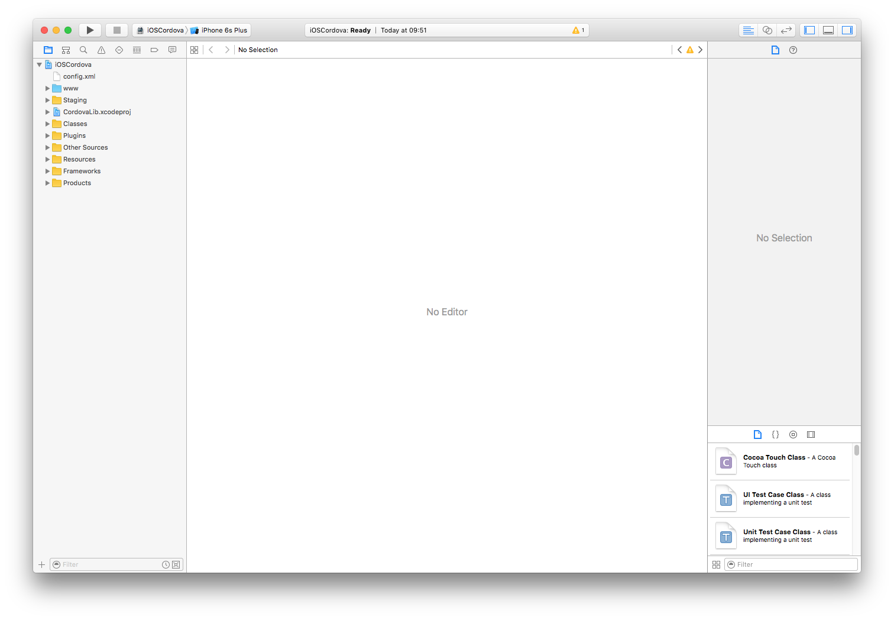
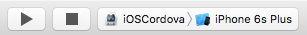
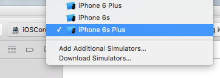
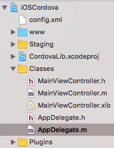
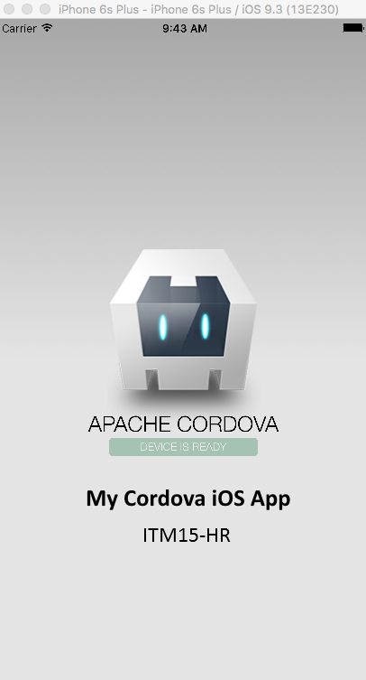
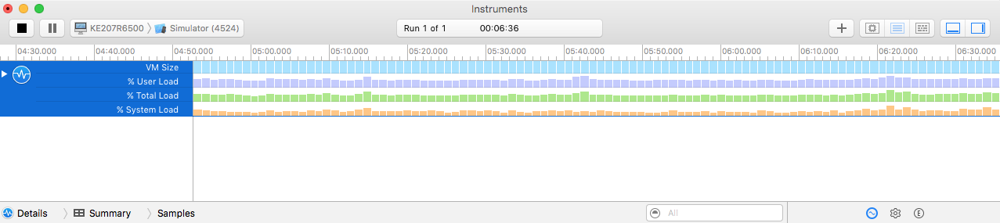

# Cordova iOS first Steps

## Necessary installations

### Cordova

> $ sudo npm install -g cordova

After instalation, a new Cordoa project can be created.

## New Cordova Project

> $ mkdir iOSApps
> 
> $ cd iOSApps/
> 
> $ cordova create iOSCordovaApp at.fhj.ims15 iOSCordova
Creating a new cordova project.

## Add Platform to Cordova Project

> $ cd iOSCordovaApp/
>
> $ cordova platform add ios

Now all necessary files for the iOS platform is added to the platforms folder:

> platforms/
> 
> └── ios

Within that ios folder there is a xcode project directory that needs to be used.

## Open Cordova project

> $ cd platforms/ios/
> 
> drwxr-xr-x   3 student  staff  102 Apr 30 09:39 iOSCordova.xcodeproj
>
> open iOSCordova.xcodeproj



## Start the app

To start the app, just click on the start button.



By default the emulator is used with the current iPhone mobile phone. The emulated device can be changed using the dropbox on the top of the window.



## Show Message in Log after start

To check also in the Log, if the app was started, it is possible to add the following line into the file "AppDelegate.m"

> NSLog(@"Cordova app started");



## Change the HTML and JavaScript

### HTML
Change the file located in _www/index.html_ like that:
```
<div>
  <h1>My Cordova iOS App</h1>
  ITM15-HR
</div>
```



### JavaScript
Change the file located in _www/js/index.js_

Here you can put any related Java code that might use you plug-ins.

## Performance

The performance of the app can be analysed via Instruments.  
Just right click on XCode/Open/Developer/Tool/Instruments



## Debug app

There are different ways to debug the app.

### Use the xcode debugger
1. First open XCode and the Cordova project (located in platforms/ios)
2. Create a breakpoint
3. Run the program in XCode
4. Programm stops when reaching the breakpoint

### Remote debug in browser
1. Open the browser e.g. Safari
2. Go to Menu/Develop/Simulator/index.html
3. Use Safari developer tools to debug the code

